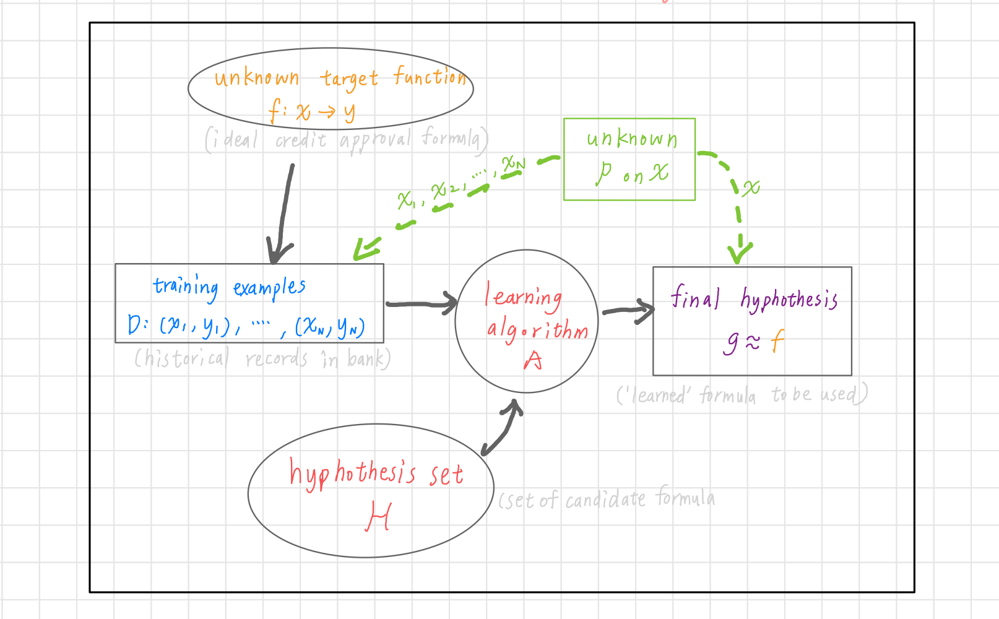

## 學習的可行性
上面我們探討了許多種學習方法  
可是你有沒有想過: 學習真的可行嗎?  
的確，如果我們不加以限制條件，你永遠有理由可以說**我這個學習方法，回答了錯的答案！**  
就算我們在training set上都得到了完美的結果，但誰知道在這set之外的數據，我們的model能否一樣完美呢？  
其實這很正常，我們想在training set外還能得到完美的結果本就是不可能的，畢竟**No free lunch**嘛！  
No free lunch定理是說：沒有一種model能在任何情況下都表現預測得很完美！所以我們說這個model比那個model好，也只是針對特定的條件下去做比較的。  
> 啊講到這裡是想跟我說，預測本來就是不可能ㄇ？那這樣還要learn啥？

根據我們的Hoeffding's inequality(霍夫丁不等式)，我們的誤差值是有一個上限的。儘管我們不知道真正的答案是多少，sample的數量越多，誤差就會越少！
> 總結一下：如果樣本數夠大，樣本中h(x) != f(x)的機率可以推導出整個抽樣空間中h(x) != f(x)的機率。兩者的機率是PAC，所以如果前面機率是小的，那後面也是小的。

我們再引入`Ein(h)`和`Eout(h)`的觀念到Hoeffding's inequality中，`Ein(h)`是指training sample上答案錯的機率，而`Eout(h)`是指整個數據上答案錯的機率。不等式表明了`Ein(h)`是很接近`Eout(h)`的 (PAC的觀念)，可是這在兩error都很大的情況下也有可能成立。所以我們要選好model讓`Ein(h)`是小的，`Eout(h)`也才會是小的！  

以上hoeffding的誤差上限都是根據一個hypothesis的說法，**但如果是很多hypothesis呢**？  
  
hoeffding不等式右邊就會乘上`M`(hypothesis的個數)然後作為union bound。問題其實很好處理，如果`M`的個數有限，那麼還是有個上限在！

> 好！所以接下來我們要處理的就是這個M的問題。這個M的問題也是不小...

如果M很小的話，看起來我們的bound會比較低，但這也代表我們hypothesis的選擇比較少！  
反過來的話，hypothesis選擇多，我們的bound又變大了！  
我們得拿個東西來取代 M  

我們回到上面的union bound看看，我們把每個hypothesis的bad event假設為互相獨立，所以把全部的機率加起來。但是真的有互相獨立嗎？如果兩個hypothesis很相似，那他們的bad event理所當然會重疊吧！所以我們可能高估了這個bound...  

我想把hypothesis的數量減少，所以我把相似的hypothesis都分到同一群。分類的方法由input的結果來區分，假設在二D空間中的一個點，我們可以把它區分為 o 類，也可以是 x 類。那其實也代表，我們所有的hypothesis只有分兩種: 1. 把這個點區分為 o 類的，2. 把這個點區分為 x 類的。先不要急著說可以把hypothesis定義為`2^N`類。假設三點共線，那我們怎麼樣都**沒辦法分到八類**的，到這裡其實我們就證明了: 就算有無限多的hypothesis，我們還是能夠學習的！  

> 只要我們能夠保證我們自己的 m << 2^N，也就是右邊趨近於0，那麼 M 再怎麼大也只是個笑話！

我們現在可以把原本的hypothesis set換成**dichotomy**，他是那些能夠把空間中的點完美分類的線的集合，size上限為`2^N`。把每個hypothesis依賴於sample數的變化搞成一個growth function的話，那我們會希望growth function會是polynomial的，而非exponential的。最小需要多少sample才能讓growth function小於exponential就是我們要找的break point。

