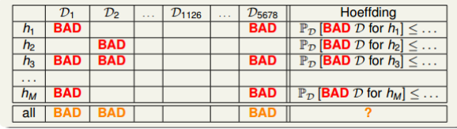
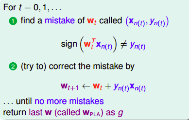

## ㄚ茂的筆記

### 學習方法：
| 方法        | 有沒有label | 描述  |
| ------------- |:-------------:|:-----|
| supervised learning | 全都有 | 二元分類，多元分類，回歸。按照輸出空間的話，還可以在區分出結構化學習(細節放在下面)。 |
| unsupervised learning | 沒有 | clustering |
| semi- | 有些有 |  |
| reinforcement learning | 我們給的不是label | 寵物訓練的例子很好懂。我們給machine的output feedback，告訴他是對的還是不對的。最重要的是這個學習的過程是sequential的，machine會透過一筆一筆資料學習，而非我們一次餵大筆資料。 |

> 上面提到的結構化學習(structure learning)？在NLP的領域很常見。假設我們要區分單字的詞性，然而單字的詞性往往不能只看個體，而是需要透過整個句子的架構去判斷。所以y的輸出可能是 {pronoun/verb/noun, pronoun/verb/pronoun, noun/verb/noun, pronoun/verb...}。我們只知道類別之間會有緊密的關係。

根據協議可以分三種learning：
| 方法        | 描述  |
| ------------- |:-----|
| batch learning | 一次性餵入所有的training sample，創建model |
| online learning | sequentially學習，hypothesis是動態的不斷進步。所以跟我們的PLA和強化學習都很合得來，PLA會透過一筆一筆的錯誤去作修正... |
| active learning | 我們希望machine自己問問題，**improve hypothesis with fewer labels by asking questions strategically** (通常用於取得label成本較高的時候) |

### 學習的可行性
上面我們探討了許多種學習方法  
可是你有沒有想過: 學習真的可行嗎?  
的確，如果我們不加以限制條件，你永遠有理由可以說**我這個學習方法，回答了錯的答案！**  
就算我們在training set上都得到了完美的結果，但誰知道在這set之外的數據，我們的model能否一樣完美呢？  
其實這很正常，我們想在training set外還能得到完美的結果本就是不可能的，畢竟**No free lunch**嘛！  
No free lunch定理是說：沒有一種model能在任何情況下都表現預測得很完美！所以我們說這個model比那個model好，也只是針對特定的條件下去做比較的。  
> 啊講到這裡是想跟我說，預測本來就是不可能ㄇ？那這樣還要learn啥？

根據我們的Hoeffding's inequality(霍夫丁不等式)，我們的誤差值是有一個上限的。儘管我們不知道真正的答案是多少，sample的數量越多，誤差就會越少！
> 總結一下：如果樣本數夠大，樣本中h(x) != f(x)的機率可以推導出整個抽樣空間中h(x) != f(x)的機率。兩者的機率是PAC，所以如果前面機率是小的，那後面也是小的。

我們再引入`Ein(h)`和`Eout(h)`的觀念到Hoeffding's inequality中，`Ein(h)`是指training sample上答案錯的機率，而`Eout(h)`是指整個數據上答案錯的機率。不等式表明了`Ein(h)`是很接近`Eout(h)`的 (PAC的觀念)，可是這在兩error都很大的情況下也有可能成立。所以我們要選好model讓`Ein(h)`是小的，`Eout(h)`也才會是小的！  

以上hoeffding的誤差上限都是根據一個hypothesis的說法，**但如果是很多hypothesis呢**？  
  
hoeffding不等式右邊就會乘上`M`(hypothesis的個數)然後作為union bound。問題其實很好處理，如果`M`的個數有限，那麼還是有個上限在！

> 好！所以接下來我們要處理的就是這個M的問題。這個M的問題也是不小...

如果M很小的話，看起來我們的bound會比較低，但這也代表我們hypothesis的選擇比較少！  
反過來的話，hypothesis選擇多，我們的bound又變大了！  
我們得拿個東西來取代 M  

我們回到上面的union bound看看，我們把每個hypothesis的bad event假設為互相獨立，所以把全部的機率加起來。但是真的有互相獨立嗎？如果兩個hypothesis很相似，那他們的bad event理所當然會重疊吧！所以我們可能高估了這個bound...  

我想把hypothesis的數量減少，所以我把相似的hypothesis都分到同一群。分類的方法由input的結果來區分，假設在二D空間中的一個點，我們可以把它區分為 o 類，也可以是 x 類。那其實也代表，我們所有的hypothesis只有分兩種: 1. 把這個點區分為 o 類的，2. 把這個點區分為 x 類的。先不要急著說可以把hypothesis定義為`2^N`類。假設三點共線，那我們怎麼樣都**沒辦法分到八類**的，到這裡其實我們就證明了: 就算有無限多的hypothesis，我們還是能夠學習的！  

> 只要我們能夠保證我們自己的 m << 2^N，也就是右邊趨近於0，那麼 M 再怎麼大也只是個笑話！

我們現在可以把原本的hypothesis set換成**dichotomy**，他是那些能夠把空間中的點完美分類的線的集合，size上限為`2^N`。把每個hypothesis依賴於sample數的變化搞成一個growth function的話，那我們會希望growth function會是polynomial的，而非exponential的。最小需要多少sample才能讓growth function小於exponential就是我們要找的break point。

### 來談談我們不同種類的input (feature)
| 輸入        | 描述  |
| ------------- |:-----|
| concrete feature | 具體的特徵，對ML也是最容易使用的輸入。e.g. 字跡對稱性，密度 |
| raw feature | 稍微抽象 e.g. 灰階256*256的各個數值 |
| abstract feature | 完全抽象，沒有含義 |

所以我們要把feature都轉換為比較有意義的像是concrete feature！這個過程也稱為**特徵工程(feature engineering)**。

### How to answer yes or no?
模型選擇：從hypothesis set中找到對的hypothesis
* 透過PLA演算法(Perceptron Learning Algorithm)來分類  
  
上圖中是我們的classifier  
`wt + 1`為修正後的權重，`t`則是代表第幾輪  

## ㄚ柔的筆記

### Leture 3 Types of Learning

| 模型名稱 | 適合數據類型 | 例子 | 
| ------------- | :-------------: | :----- |
| Binary Classification | 是非題 | 1,-1 |
| Multiclass Classification | 分種類 | 視覺辨識 |
| Regression | 連續數字 | 股票、溫度 |

| 學習名稱        | 解釋 | 例子  |
| ------------- |:-------------:|:-----|
| Supervised Learning | 每個x都有相對應的y| |
| Unsupervised Learning | 每個x都沒有相對應的y | 1.clustering 2.desity estimation 3.outlier detection |
| Semi-supervised Learning | 每個x不一定都有相對應的y | 1.FB的照片辨識朋友功能(有些人有label了) 2.藥效預測 (label比較昂貴時適用)|
| Reinforcement Learning | 對或錯的方式訓練機器 | 1.廣告系統(利用客戶反應訓練) 2.計算玩牌的勝算 |

| 協議方法名稱        | 解釋  |
| ------------- |:-----|
| Batch Learning (批量學習) | 填鴨式教育 |
| Online Learning | 被動學習 |
| Active Learning | 主動提問(用於label比較貴的數據) |

| 輸入名稱        | 解釋  |
| ------------- |:-----|
| Concrete Feature | 具體特徵，複雜且可能相關的描述 |
| Raw Feature | 沒有具體特徵，需要人或機器轉換成具體特徵，簡單的描述 |
| Abstract Feature | 沒有具體特徵，需要人或機器轉換成具體特徵，沒有描述 |

### Leture 4 Feasibility of Learning

怎樣是好的學習?
* 好的學習:對於h而言Ein(h)是小的，且演算法選擇的h趨近於g ==> 'g=f' PAC
* 不好的學習:Ein通常不小，演算法被迫選擇h作為g ==> 'g!=f' PAC
* 實際情況:演算法自己做選擇H(ex:PLA),而非被迫選擇h

有很多的H，應該用哪種呢?
* 比較合理的演算法(PLA/pocket):選擇一個擁有最小Fin(Hm)當作g的Hm

只有一個H(hypothesis)的Bad Data:
*Eout(H)和Ein(H)差很多
有很多H的Bad Data:
*存在部分H會有Eout(H)和Ein(H)差很多的問題(演算法無法自由做選擇)

Learning到底可不可行?
假如|H|=M(hypothesis)是有限的，N(資料量)足夠大，不論哪個被演算法選中的g都會有，Ein(g)≈Eout(g)的結果
假如演算法找到一個Ein(g)≈0的g，PAC保證Eout(g)也會趨近於0 --->learning possible!

### Leture 5 Training V.S. Testing
在Ein(g)≈Eout(g)≈0 這樣的基礎下，Eout(g)≈0是機器在訓練的部分，而Ein(g)≈Eout(g)是測試這個model可不可行的階段

##### 為了衡量一下M(amount of hypothesis set)大比較好還是小，提出兩個問提:
- 1.我們可以確定Eout(g)靠近Ein(g)嗎?
- 2.Ein(g)他夠小嗎?

##### 在數量小的M:
- 1.Yes! 會發現M帶入P[BAD]=<2*M*exp(...)公式，因為M小，P[BAD]也會變小
- 2.No! 因為M小，選擇太少了

##### 在數量大的M:
- 1.No! P[BAD]增加
- 2.Yes! 因為M大，選擇很多，可以找到夠小的Ein(g)

### Leture 6 Theory of Generalization

### Leture 7 The VC Dimension 

#### M and dvc:

##### 為了衡量一下M(amount of hypothesis set)和dvc大比較好還是小，提出兩個問提:
- 1.我們可以確定Eout(g)靠近Ein(g)嗎?
- 2.Ein(g)他夠小嗎?

##### 在數量小的M:
- 1.Yes! 會發現M帶入P[BAD]=<2*M*exp(...)公式，因為M小，P[BAD]也會變小
- 2.No! 因為M小，選擇太少了

##### 在數量大的M:
- 1.No! P[BAD]增加
- 2.Yes! 因為M大，選擇很多，可以找到夠小的Ein(g)

##### 在數量小的dvc:
- 1.Yes! 會發現dvc帶入P[BAD]=<2*(2N)^dvc*exp(...)公式，因為dvc小，P[BAD]也會變小
- 2.No! 因為dvc小，限制太多

##### 在數量大的dvc:
- 1.No! P[BAD]增加
- 2.Yes! 很多權利

### Leture 8 Noise and Error

##### VC bound在有雜訊的情況下會不會work?
依然會

##### 目標分佈P(y|x) (理想的mini-target + noise):
例子:P(o|x)=0.7, P(x|x)=0.3
- ideal mini-target f(x)=o
- noise level=0.3
  
##### Goal of Learning:
預測ideal mini-target(w.r.t P(y|x))
在often-seen inputs(w.r.t P(y|x))
  
##### 兩個主要的error measure:
(1) 0/1 error:
- 直接用於對或錯
- 常用在classification

(2) squared error
- 算y~和y之間的距離
- 常用在regression

##### 總的來說，ideal mini-target是noise和error組成的

##### True negative, false negative有趣的例子:
- Supermarket和CIA指紋辨識的false accecpt和false reject的成本

找Ew in(h)最小值，即可得出最好的Ew in(h)

### Leture 9 Linear Regression
- 特徵x=(x0,x1,x2,....,xd)
- 加權sum: y ≈ Σ(i=0->d)wixi
- Linear Regression Hypothsis: h(x)=w^T*x
- 找一條residuals最小的線
- 是連續、可以微分且有谷(有最小值)的函數

##### 要如何知道他是否真的有學習到
看Eout(wLIN)是否是好的(最小值)
