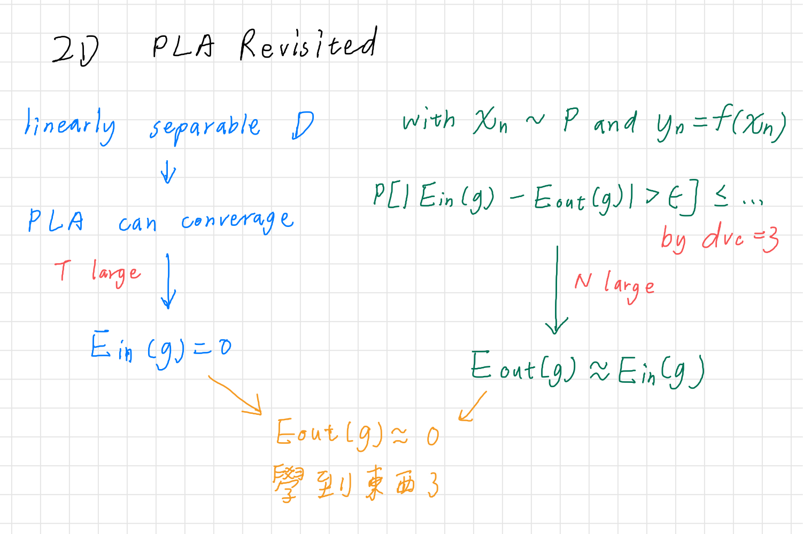
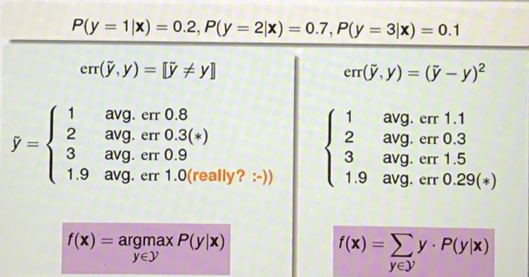
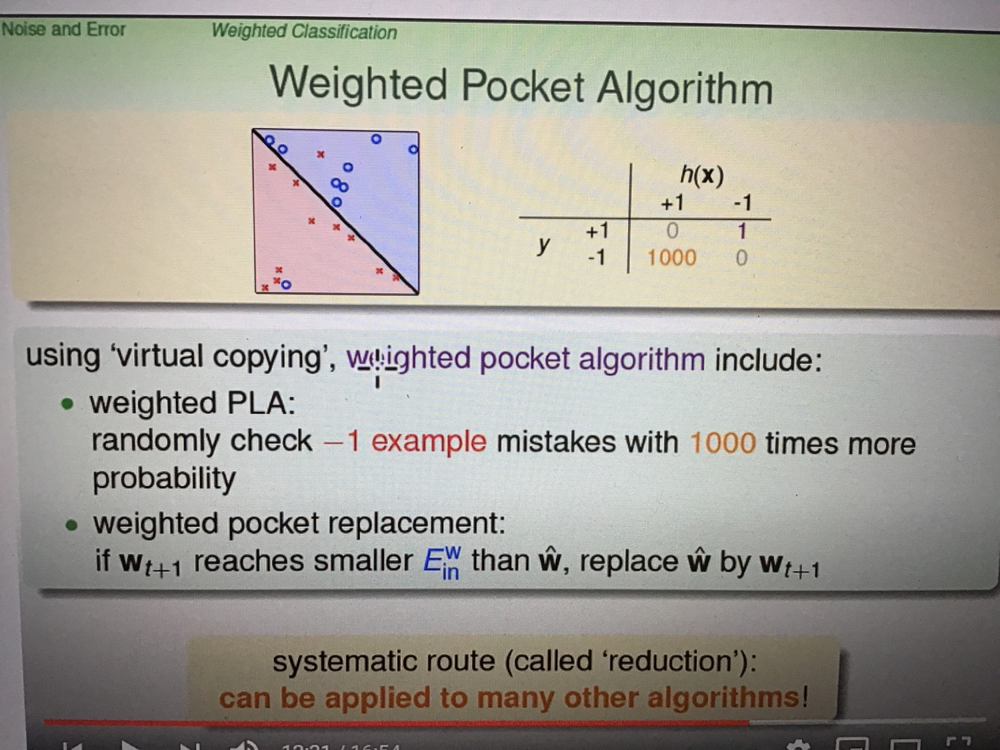

# ML-_-DL
- [ML-_-DL](#ml-_-dl)
  - [ML](#ml)
  - [ML數學概率基礎](#ml數學概率基礎)
  - [維度](#維度)
  - [學習方法](#學習方法)
  - [來談談我們不同種類的input](#來談談我們不同種類的input)
  - [Training versus Testing](#Training-versus-Testing)
  - [Theory of Generalization](#Theory-of-Generalization)
  - [The VC Dimension](#The-VC-Dimension)
  - [Validation](#Validation)
  - [學習的可行性](#學習的可行性)
  - [linear classification](#linear-classification)
  - [Linear Regression](#linear-regression)
    - [Generative model v.s. Discriminative model](#generative-model-vs-discriminative-model)
    - [SVM](#svm)
  - [DL](#dl)
  - 
    - [Leture 6 Theory of Generalization](#leture-6-theory-of-generalization)
    - [Leture 7 The VC Dimension](#leture-7-the-vc-dimension)
      - [M and dvc:](#m-and-dvc)
        - [為了衡量一下M(amount of hypothesis set)和dvc大比較好還是小，提出兩個問提:](#為了衡量一下mamount-of-hypothesis-set和dvc大比較好還是小提出兩個問提)
        - [在數量小的M:](#在數量小的m-1)
        - [在數量大的M:](#在數量大的m-1)
        - [在數量小的dvc:](#在數量小的dvc)
        - [在數量大的dvc:](#在數量大的dvc)
    - [Leture 8 Noise and Error](#leture-8-noise-and-error)
        - [VC bound在有雜訊的情況下會不會work?](#vc-bound在有雜訊的情況下會不會work)
        - [目標分佈P(y|x) (理想的mini-target + noise):](#目標分佈pyx-理想的mini-target--noise)
        - [Goal of Learning:](#goal-of-learning)
        - [兩個主要的error measure:](#兩個主要的error-measure)
        - [總的來說，ideal mini-target是noise和error組成的](#總的來說ideal-mini-target是noise和error組成的)
        - [True negative, false negative有趣的例子:](#true-negative-false-negative有趣的例子)

## ML
* What is machine learning?  
通過觀察大量的data，並且發現規律，來解決問題

* Learning: supervised learning v.s. unsupervised learning?  
有label v.s. 沒有label，我們的training set有沒有answer

* problem categories of supervised learning?  
classification problem, regression problem

* problem categories of unsupervised learning?  
clustering, non-clustering

* machine learning v.s. data mining?  
ML: use data to compute hypothesis g which approximates f.  
DM: use huge data to find interesting properties.  

* machine learning v.s. A.I.?  
ML只是A.I.其中一個領域

* machine learning v.s. statistics?  
統計是ML的重要工具 :cry:

## ML數學概率基礎
* [數學概率基礎](./Math-Probs-Statistics/README.md)

## 維度
* [維度災難 (Curse of dimensionality)](./dimension.md#維度災難)
* [PLA 降維](./dimension.md#pca-principal-component-analysis)

## 學習方法
| 方法        | 有沒有label | 描述  |
| ------------- |:-------------:|:-----|
| supervised learning | 全都有 | 二元分類，多元分類，回歸。按照輸出空間的話，還可以在區分出結構化學習(細節放在下面)。 |
| unsupervised learning | 沒有 | clustering, desity estimation, outlier detection |
| semi- | 有些有 | FB的照片辨識朋友功能(有些人有label了), 藥效預測 (label比較昂貴時適用) |
| reinforcement learning | 我們給的不是label | 寵物訓練的例子很好懂。我們給machine的output feedback，告訴他是對的還是不對的。最重要的是這個學習的過程是sequential的，machine會透過一筆一筆資料學習，而非我們一次餵大筆資料。 |

> 上面提到的結構化學習(structure learning)？在NLP的領域很常見。假設我們要區分單字的詞性，然而單字的詞性往往不能只看個體，而是需要透過整個句子的架構去判斷。所以y的輸出可能是 {pronoun/verb/noun, pronoun/verb/pronoun, noun/verb/noun, pronoun/verb...}。我們只知道類別之間會有緊密的關係。

根據協議可以分三種learning：
| 方法        | 描述  |
| ------------- |:-----|
| batch learning | 一次性餵入所有的training sample，創建model |
| online learning | sequentially學習，hypothesis是動態的不斷進步。所以跟我們的PLA和強化學習都很合得來，PLA會透過一筆一筆的錯誤去作修正... |
| active learning | 我們希望machine自己問問題，**improve hypothesis with fewer labels by asking questions strategically** (通常用於取得label成本較高的時候) |

## 來談談我們不同種類的input
| 輸入        | 描述  |
| ------------- |:-----|
| concrete feature | 具體的特徵，對ML也是最容易使用的輸入。e.g. 字跡對稱性，密度 |
| raw feature | 稍微抽象 e.g. 灰階256*256的各個數值 |
| abstract feature | 完全抽象，沒有含義 |

所以我們要把feature都轉換為比較有意義的像是concrete feature！這個過程也稱為**特徵工程(feature engineering)**。

## Training versus Testing
在Ein(g)≈Eout(g)≈0 這樣的基礎下，Eout(g)≈0是機器在訓練的部分，而Ein(g)≈Eout(g)是測試這個model可不可行的階段

##### 為了衡量一下M(amount of hypothesis set)大比較好還是小，提出兩個問提:
- 1.我們可以確定Eout(g)靠近Ein(g)嗎?
- 2.Ein(g)他夠小嗎?

##### 在數量小的M:
- 1.Yes! 會發現M帶入P[BAD]=<2*M*exp(...)公式，因為M小，P[BAD]也會變小
- 2.No! 因為M小，選擇太少了

##### 在數量大的M:
- 1.No! P[BAD]增加
- 2.Yes! 因為M大，選擇很多，可以找到夠小的Ein(g)

## Theory of Generalization

## The VC Dimension 

#### M and dvc:

##### 為了衡量一下M(amount of hypothesis set)和dvc大比較好還是小，提出兩個問提:
- 1.我們可以確定Eout(g)靠近Ein(g)嗎?
- 2.Ein(g)他夠小嗎?

##### 在數量小的M:
- 1.Yes! 會發現M帶入P[BAD]=<2*M*exp(...)公式，因為M小，P[BAD]也會變小
- 2.No! 因為M小，選擇太少了

##### 在數量大的M:
- 1.No! P[BAD]增加
- 2.Yes! 因為M大，選擇很多，可以找到夠小的Ein(g)

##### 在數量小的dvc:
- 1.Yes! 會發現dvc帶入P[BAD]=<2*(2N)^dvc*exp(...)公式，因為dvc小，P[BAD]也會變小
- 2.No! 因為dvc小，限制太多

##### 在數量大的dvc:
- 1.No! P[BAD]增加
- 2.Yes! 很多權利

## Validation
[Validation](./validation/README.md)

## 學習的可行性
* [學習的可行性](./Feasibility-Learning/README.md)

## linear classification
* [線性分類](linear-classification/README.md)
* [線性判別函數(linear discriminant function)](linear-classification/README.md)
* [Fisher線性判別函數](linear-classification/README.md)
* [PLA](linear-classification/README.md)
* [推薦閱讀：線性判別分析](https://ccjou.wordpress.com/2014/03/20/%E7%B7%9A%E6%80%A7%E5%88%A4%E5%88%A5%E5%88%86%E6%9E%90/)

## Linear Regression
* [線性迴歸](./linear-regression/README.md)

### Generative model v.s. Discriminative model
* [Generative model v.s. Discriminative model](./Gen-Model-and-Dis-Model/README.md)

### SVM
* [先從kernel trick是啥講起](./SVM/README.md)
* [SVM入場](./SVM/README.md)

## DL
* [什麼是Nueral Network?](./DL/README.md)
* [CNN](./DL/README.md)
* [BP (Back Propagation)](./back-propagation/README.md)

### Leture 8 Noise and Error

##### VC bound在有雜訊的情況下會不會work?
當然

##### 目標分佈P(y|x) (理想的mini-target + noise):
例子:P(o|x)=0.7, P(x|x)=0.3
- ideal mini-target f(x)=o
- noise level=0.3
  
##### Goal of Learning:
預測ideal mini-target(w.r.t P(y|x))
在often-seen inputs(w.r.t P(y|x))
  
##### 兩個主要的error measure:
(1) 0/1 error:
- 直接用於對或錯
- 常用在classification

(2) squared error
- 算y~和y之間的距離
- 常用在regression

##### 結論: ideal mini-target是noise和error組成的

##### True negative, false negative有趣的例子:
- Supermarket和CIA指紋辨識的false accecpt和false reject的成本

找Ew in(h)最小值，即可得出最好的Ew in(h)
當然因為比較慢啊  
