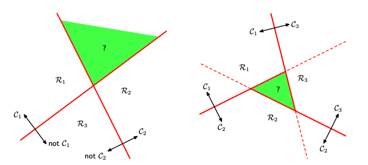

# ML-_-DL
- [ML-_-DL](#ml-_-dl)
  - [ML](#ml)
  - [ML數學概率基礎](#ml數學概率基礎)
  - [維度](#維度)
  - [學習方法：](#學習方法)
  - [來談談我們不同種類的input](#來談談我們不同種類的input)
  - [validation](#validation)
  - [學習的可行性](#學習的可行性)
  - [linear classification](#linear-classification)
    - [用linear classification解釋generative model和discriminative model](#用linear-classification解釋generative-model和discriminative-model)
    - [SVM](#svm)
  - [DL](#dl)
  - [Refer](#refer)

## ML
* What is machine learning?  
通過觀察大量的data，並且發現規律，來解決問題

* Learning: supervised learning v.s. unsupervised learning?  
有label v.s. 沒有label，我們的training set有沒有answer

* problem categories of supervised learning?  
classification problem, regression problem

* problem categories of unsupervised learning?  
clustering, non-clustering

* machine learning v.s. data mining?  
ML: use data to compute hypothesis g which approximates f.  
DM: use huge data to find interesting properties.  

* machine learning v.s. A.I.?  
ML只是A.I.其中一個領域

* machine learning v.s. statistics?  
統計是ML的重要工具 :cry:

## ML數學概率基礎
:star: Bayesian probabilities  
一般的事件我們可以用高中數學統計出概率。啊如果是不確定性的事件呢？不確定性的事件就是：這些事件無法重複多次，也就是我們有生之年可能沒法統計出他的概率。我們希望用一個更通用的方式來定量化這些事件，就要用到 Bayesian probabilities。  
先複習個貝式定理：  

<a href="https://www.codecogs.com/eqnedit.php?latex=P(A|B)&space;=&space;\frac{P(B|A)P(A)}{P(B)}" target="_blank"></a>  
說到我們ML中的不確定性，可以說是model的參數囉，這裡就先給個`w`！我們在觀察到dataset以前，會先對`w`做個假設，也就是prior prob：`p(w)`。觀察完dataset之後的conditional prob可以用`p(D|w)`來表示。Bayesian讓我們可以通過一個形式表示這個不確定性(也就是這裡的posterior prob)：  

<a href="https://www.codecogs.com/eqnedit.php?latex=P(w|D)&space;=&space;\frac{P(D|w)P(w)}{P(D)}" target="_blank"></a>  
細部探討一下上面這個formula:   
`P(D|w)`可以當成我們model參數`w`的function，別稱**likelihood function**。他表示在不同參數下，該dataset出現的概率。  
`P(D)`則是確保合理的概率密度，積分為1  
<a href="https://www.codecogs.com/eqnedit.php?latex=p(D)&space;=&space;\int&space;p(D&space;|&space;w)p(w)&space;dw" target="_blank"></a>  

對於likelihood function，我們的目標是使其最大化(有沒有很熟悉maximum likelihood呀)，`w`應該使我們的likelihood funciton達到最大值(出現同樣dataset的機率越高)。而likelihood的負對數則是所謂的**error function**，根據單調成長的特性，我們讓maximum likelihood等同於minimize error function！  

:star: Gaussian distribution  
一種連續變量的正態分佈。對於一元變量x，我們將高斯分佈定義為：  

<a href="https://www.codecogs.com/eqnedit.php?latex=N(x|\mu&space;,\sigma&space;^2)=&space;\frac{1}{\sqrt{2\pi&space;\sigma^2}}&space;exp\left&space;\{&space;-\frac{1}{2\sigma^2}(x-\mu)^{2}&space;\right&space;\}" target="_blank"></a>  
`μ`: 平均值  
`σ^2`: 變異數，也就是標準差的平方  
`1/(σ^2)`: 精準度  
  
看了這張圖，有沒有清楚許多呢？  
而且lvalue必然大於等於0，然後積分也為1。所以把他當成概率密度函數也不為過！  
當然真實世界中我們不會是一元的分佈，像上面在講貝式的時候我們就有`D`維的向量，`D`維的高斯分佈大概長這樣吧(看看就好的概念)...  

<a href="https://www.codecogs.com/eqnedit.php?latex=N(x|\mu&space;,\sum&space;)=&space;\frac{1}{(2\pi)^{\frac{D}{2}}}\frac{1}{(\left&space;|&space;\sum&space;\right&space;|)^\frac{1}{2}}&space;exp\left&space;\{&space;-\frac{1}{2}(x-\mu)^{T}\sum&space;(x-\mu)&space;\right&space;\}" target="_blank"></a>  

現在假定我們從D維的dataset中，做多次抽取，而每次的抽取事件也都互相獨立，別稱i.i.d. (independent and identically distributed)。那我們可以給我這些事件的聯合分佈：  

<a href="https://www.codecogs.com/eqnedit.php?latex=p(x|\mu,&space;\sigma&space;^2)=&space;\prod_{n=1}^{N}N(xn|\mu,&space;\sigma&space;^2)" target="_blank"></a>  
這其實就是gaussian的likelihood function啦！  
一樣我們的目標是maximum likelihood，實際應用中我們會考慮求likelihood的對數值更為方便。因為對數函數是單調遞增，所以我們最大化likelihood相當於在最大化對數值。  
  
下面兩個便是我們的sample mean和sample variance。細部的數學證明我就不在這裡耗篇幅囉...  

當我們找到maximum likelihood的解時，會發現居然低估了variance。這也是我們maximum likelihood的局限性。這種問題叫作**bias**，跟polynomial curve fitting中會遇到的overfitting有關！當我們點N的數量繼續上升的時候，那bias的現象會越來越不嚴重。  

> 這邊小提醒一下，maximum likelihood的bias問題便是我們poly curve fitting中overfittin問題的核心...

:star: Decision Theory  
決策論是我們在面對不確定性時做出的最優策略  
舉個🌰，我們想給病人拍x光片判斷他有沒有得癌症。  
Training data: 假設輸入向量是x，為x光片的pixel值。輸出變量為t = 0: C1為患有癌症，t = 1: C2為不患有癌症。  
Inference: 這個問題就變成一個聯合概率分佈的問題：`p(x, Ck)`。  
Inference step: 評估`p(x, Ck)`。  
Decision step: 從x推斷Ck讓error最小化  

<a href="https://www.codecogs.com/eqnedit.php?latex=p(Ck|x)&space;=&space;\frac{p(x|Ck)p(Ck)}{p(x)}" target="_blank"></a>  
所謂的error就是將x預測成錯誤的class。換句話說，我們想讓posterior prob(`p(Ck|x)`)最大。  

把x區分到對的類別會將輸入空間切成不同的區域，也就是decision region。而邊界就叫decision boundary，可以為不連續。  

:star: minimize expected loss  

<a href="https://www.codecogs.com/eqnedit.php?latex=\begin{bmatrix}&space;0&space;&&space;1000\\&space;1&space;&&space;0&space;\end{bmatrix}" target="_blank"></a>  
此為loss matrix: `[0][x]`和`[x][0]`為癌症，`[1][x]`和`[x][1]`為健康  
繼續上面癌症的🌰，結合這個loss matrix。我們判斷對都還沒事，loss為0，重點是在判斷錯的損失。把正常的人判斷為癌症，那這損失為1。如果把癌症的人判斷為正常，這損失可就嚴重了，人都會死了！  
我們的最優解是讓這loss function value最小，也就是讓平均loss最小。我們用聯合概率分佈來表示loss function的平均值：  

<a href="https://www.codecogs.com/eqnedit.php?latex=E[L]&space;=&space;\sum_{k}^{}\sum_{j}^{}\int_{Rj}^{}Lkjp(x,&space;Ck)dx" target="_blank"></a>  
請服用`p(x, Ck) = p(Ck|x)p(x)`:  
我們只要最小化  

<a href="https://www.codecogs.com/eqnedit.php?latex=\sum_{k}^{}Lkjp(Ck|x)" target="_blank"></a>  
一旦我們知道了posterior prob的值，這就很簡單囉！  

決定好decision step後，還有一種情況是reject option。癌症的🌰中，有時候會有很難判斷的x光片子要交給專家，不適合用我們自動化的decision step。這時候就會跑出一個threshold，怎樣難度的片子我們才會交給專家。

> 接下來為大家總結一下解決decision problem的三種方法喔...

-> generative model  
在inference stage，對於每個`Ck`，先獨立計算出`p(x|Ck)`並推斷出`p(Ck)`。再使用貝式算出posterior prob：  

<a href="https://www.codecogs.com/eqnedit.php?latex=p(Ck|x)&space;=&space;\frac{p(x|Ck)p(Ck)}{p(x)}" target="_blank"></a>  
也就是上面的`p(Ck|x)`。一如往常，我們可以將貝式中的分母用分子中的項表示：  

<a href="https://www.codecogs.com/eqnedit.php?latex=p(x)&space;=&space;\sum_{k}^{}p(x|Ck)p(Ck)" target="_blank"></a>  
然後用decision step決定哪個class。  

-> disciminative model  
則是對posterior prob直接建立model。  

-> 還有一種是找到一種function能直接將input map到class label的。這就跟probability八竿子打不著了。

## 維度
* [維度災難 (Curse of dimensionality)](./dimension.md#維度災難)
* [PLA 降維](./dimension.md#pca-principal-component-analysis)

## 學習方法：
| 方法        | 有沒有label | 描述  |
| ------------- |:-------------:|:-----|
| supervised learning | 全都有 | 二元分類，多元分類，回歸。按照輸出空間的話，還可以在區分出結構化學習(細節放在下面)。 |
| unsupervised learning | 沒有 | clustering |
| semi- | 有些有 |  |
| reinforcement learning | 我們給的不是label | 寵物訓練的例子很好懂。我們給machine的output feedback，告訴他是對的還是不對的。最重要的是這個學習的過程是sequential的，machine會透過一筆一筆資料學習，而非我們一次餵大筆資料。 |

> 上面提到的結構化學習(structure learning)？在NLP的領域很常見。假設我們要區分單字的詞性，然而單字的詞性往往不能只看個體，而是需要透過整個句子的架構去判斷。所以y的輸出可能是 {pronoun/verb/noun, pronoun/verb/pronoun, noun/verb/noun, pronoun/verb...}。我們只知道類別之間會有緊密的關係。

根據協議可以分三種learning：
| 方法        | 描述  |
| ------------- |:-----|
| batch learning | 一次性餵入所有的training sample，創建model |
| online learning | sequentially學習，hypothesis是動態的不斷進步。所以跟我們的PLA和強化學習都很合得來，PLA會透過一筆一筆的錯誤去作修正... |
| active learning | 我們希望machine自己問問題，**improve hypothesis with fewer labels by asking questions strategically** (通常用於取得label成本較高的時候) |

## 來談談我們不同種類的input
| 輸入        | 描述  |
| ------------- |:-----|
| concrete feature | 具體的特徵，對ML也是最容易使用的輸入。e.g. 字跡對稱性，密度 |
| raw feature | 稍微抽象 e.g. 灰階256*256的各個數值 |
| abstract feature | 完全抽象，沒有含義 |

所以我們要把feature都轉換為比較有意義的像是concrete feature！這個過程也稱為**特徵工程(feature engineering)**。

## validation
[Validation](./validation/README.md)

## 學習的可行性
上面我們探討了許多種學習方法  
可是你有沒有想過: 學習真的可行嗎?  
的確，如果我們不加以限制條件，你永遠有理由可以說**我這個學習方法，回答了錯的答案！**  
就算我們在training set上都得到了完美的結果，但誰知道在這set之外的數據，我們的model能否一樣完美呢？  
其實這很正常，我們想在training set外還能得到完美的結果本就是不可能的，畢竟**No free lunch**嘛！  
No free lunch定理是說：沒有一種model能在任何情況下都表現預測得很完美！所以我們說這個model比那個model好，也只是針對特定的條件下去做比較的。  
> 啊講到這裡是想跟我說，預測本來就是不可能ㄇ？那這樣還要learn啥？

根據我們的Hoeffding's inequality(霍夫丁不等式)，我們的誤差值是有一個上限的。儘管我們不知道真正的答案是多少，sample的數量越多，誤差就會越少！
> 總結一下：如果樣本數夠大，樣本中h(x) != f(x)的機率可以推導出整個抽樣空間中h(x) != f(x)的機率。兩者的機率是PAC，所以如果前面機率是小的，那後面也是小的。

我們再引入`Ein(h)`和`Eout(h)`的觀念到Hoeffding's inequality中，`Ein(h)`是指training sample上答案錯的機率，而`Eout(h)`是指整個數據上答案錯的機率。不等式表明了`Ein(h)`是很接近`Eout(h)`的 (PAC的觀念)，可是這在兩error都很大的情況下也有可能成立。所以我們要選好model讓`Ein(h)`是小的，`Eout(h)`也才會是小的！  

以上hoeffding的誤差上限都是根據一個hypothesis的說法，**但如果是很多hypothesis呢**？  
  
hoeffding不等式右邊就會乘上`M`(hypothesis的個數)然後作為union bound。問題其實很好處理，如果`M`的個數有限，那麼還是有個上限在！

> 好！所以接下來我們要處理的就是這個M的問題。這個M的問題也是不小...

如果M很小的話，看起來我們的bound會比較低，但這也代表我們hypothesis的選擇比較少！  
反過來的話，hypothesis選擇多，我們的bound又變大了！  
我們得拿個東西來取代 M  

我們回到上面的union bound看看，我們把每個hypothesis的bad event假設為互相獨立，所以把全部的機率加起來。但是真的有互相獨立嗎？如果兩個hypothesis很相似，那他們的bad event理所當然會重疊吧！所以我們可能高估了這個bound...  

我想把hypothesis的數量減少，所以我把相似的hypothesis都分到同一群。分類的方法由input的結果來區分，假設在二D空間中的一個點，我們可以把它區分為 o 類，也可以是 x 類。那其實也代表，我們所有的hypothesis只有分兩種: 1. 把這個點區分為 o 類的，2. 把這個點區分為 x 類的。先不要急著說可以把hypothesis定義為`2^N`類。假設三點共線，那我們怎麼樣都**沒辦法分到八類**的，到這裡其實我們就證明了: 就算有無限多的hypothesis，我們還是能夠學習的！  

> 只要我們能夠保證我們自己的 m << 2^N，也就是右邊趨近於0，那麼 M 再怎麼大也只是個笑話！

我們現在可以把原本的hypothesis set換成**dichotomy**，他是那些能夠把空間中的點完美分類的線的集合，size上限為`2^N`。把每個hypothesis依賴於sample數的變化搞成一個growth function的話，那我們會希望growth function會是polynomial的，而非exponential的。最小需要多少sample才能讓growth function小於exponential就是我們要找的break point。

## linear classification
分類的目標是將input分成k個離散的類型 e.g. C1, C2, ...Ck。  
模型通常是linear function。如果dataset可以被我們的model完整得分類，那這個dataset可以稱作linear separable。  

<a href="https://www.codecogs.com/eqnedit.php?latex=y(x)&space;=&space;f(w^{T}x&space;&plus;&space;w0)" target="_blank"></a>    
最簡單的情況下，模型也是由`w`和`x`的線性函數所組成的。這一類model被稱作推廣的線性模型(generalized linear model)，但跟下一個section的regression不一樣的地方是: `f()`將原本的線性函數轉換為非線性函數。  

> 線性判別函數(linear discriminant function)  

discriminant function透過input將該筆data分類  
最簡單的形式就是上面見到的`y(x) = w^Tx + w0`，`w`為權重的向量，`w0`為bias。  
如果將這個公式設為0當作我們的決策平面：若`y(x) >= 0`則分到A類，否則分到B類。那我們假設x1, x2為這個決策平面上的兩個點(兩點相連則為決策平面上的一條向量)，代入公式：  
```
y(x1) = w^Tx1 + w0 = 0
y(x2) = w^Tx2 + w0 = 0
w^T(x1 - x2) = 0
```
所以決策平面上的向量跟`w^T`作內積會得到0: 代表`w`是一條決策平面的法向量，換句話說`w`決定了我們平面的方向！  
再舉個例子：從原點到某個點x的向量 = `x'`(x向量在平面上的投影) + 垂直向量  

<a href="https://www.codecogs.com/eqnedit.php?latex=x&space;=&space;x'&space;&plus;&space;r\cdot&space;\frac{w}{|w|}" target="_blank"></a>  
我們兩邊同時乘上`w^T` 並且加上 `w0`  
代入等式`y(x) = w^Tx + w0`和`y(x') = w^Tx' + w0 = 0`，最後可以得到  

<a href="https://www.codecogs.com/eqnedit.php?latex=y(x)&space;=&space;r&space;\cdot&space;\frac{w\cdot&space;w^T}{|w|}" target="_blank"></a>  
而 `w * w^T = |w|^2`:  

可得  <a href="https://www.codecogs.com/eqnedit.php?latex=r&space;=&space;\frac{y(x)}{|w|}" target="_blank"></a>  

> 那我們的discriminant function會怎麼處理multiple class呢？  

這裡先附上一張圖：  
  

左邊那張圖是**one versus rest**的處理方法，會用(k-1)個classifier切分輸入空間，缺點是會有不知道如何是好的區域。  
右邊的圖則是**one versus one**的處理方法，一個classifier用來區分任意兩個class，所以會有(k*(k - 1)/2)個classifier，然而還是會有那個神秘區域。  
  
好的！解決辦法就是引入 Class M的判別函數: `ym(x) = wm^Tx + wm0`，由m個線性函數組合而成的。  
對於某個點x，其他所有非m類的Class n，若是 `ym(x) > yn(x)`，則我們會將x分到m類。所以Cm類與Cn類的決策平面將為 `ym(x) = yn(x)`  

進一步我們可以得到  <a href="https://www.codecogs.com/eqnedit.php?latex=(wm&space;-&space;wn)^Tx&space;&plus;&space;(wm0&space;-&space;wn0)&space;=&space;0" target="_blank"></a>  

> Fisher線性判別函數  

這個方法是透過投影進低維實現的，先來張圖：  
  
可以看到上圖投影進`w^T`的方向，結果造成兩個class的點重疊很多，這是因為投影後會丟失很多訊息。所以在使用這個方法的時候需要慎選`w^T`。上圖如果是選水平線作為投影的目標那就能完美區分了。至於區分的標準則是為y值設置一個threshold。這也正是LDA的目標 (Linear Discriminant Analysis)，那我們要怎麼找到這個絕佳的方向呢？  

假設最簡單的binary classification: C1, C2  
m1則為C1群的平均向量，m2則為C2群的平均向量  
要看兩個的區分程度可以從 `m2 - m1` 所得：而我們要找到一個`w^T`讓他投影後得到 `w^T(m2 - m1)` 的最大值！  
fisher的思想除了讓mean的投影分得越開，還有讓同樣的class內部的方差變得越小。  
想當於這個的比值：  

<a href="https://www.codecogs.com/eqnedit.php?latex=max&space;\frac{(m2&space;-&space;m1)^2}{s1^2&space;&plus;&space;s2^2}" target="_blank"></a>  
分子m的差距越大越好，而分母則為兩個class內部的方差總和：  

<a href="https://www.codecogs.com/eqnedit.php?latex=si^2&space;=&space;\sum_{x->Ci}^{}(w^Tx&space;-&space;mi)^2" target="_blank">Ci}^{}(w^Tx&space;-&space;mi)^2" title="si^2 = \sum_{x->Ci}^{}(w^Tx - mi)^2" /></a>  
略過公式的代入細節，我們可以得到：  

<a href="https://www.codecogs.com/eqnedit.php?latex=J(w)&space;=&space;\frac{w^T\cdot&space;SB\cdot&space;w}{w^T\cdot&space;SW\cdot&space;w}" target="_blank"></a>  
在`J(w)`最大值的時候我們可以發現：  

<a href="https://www.codecogs.com/eqnedit.php?latex=SB\cdot&space;w&space;=&space;(m1&space;-&space;m2)(m1&space;-&space;m2)^Tw" target="_blank"></a>  
我們關心的是方向而非大小，所以像後面的`(m1-m2)^Tw`都可以不用理他了，會發現`w`在`SW^-1(m1 - m2)`的方向上。(SW為class內協方差矩陣  
看看下面的圖會更有感覺呦：  


> 透過PLA演算法(Perceptron Learning Algorithm)來分類  

<a href="https://www.codecogs.com/eqnedit.php?latex=y(x)&space;=&space;f(w^T\o&space;(x))" target="_blank"></a>. 
輸入向量會經由非線性轉換得到一個特徵向量：`φ(x)`，然後這個特徵向量將會用來構造一個linear model。其中`f()`作為activation function會輸出離散值：1 or -1。  

> 那麼，如何確定我們的w呢？ perceptron criterion

一樣可以由使誤差函數最小化的思想中得到，一個很直觀的方法便是看misclassification的總數，但這樣會很容易讓我們的誤差函數變得不連續(太難搞啦！)，因此我們再考慮另一個誤差函數唄！有一個誤差函數叫`perceptron criterion(感知機準則)`，這個想法其實很好懂喔: 透過上面的公式，我們已經知道model輸出為1 or -1，我們現在用變量t來取代為一個`{1, -1}`的集合。對於c1類，我們可以得到輸出值大於0，而對於c2類我們可以得到輸出值小於0。這是不是也代表著，只要分類對了：  

<a href="https://www.codecogs.com/eqnedit.php?latex=w^T\phi&space;(xn)tn&space;>&space;0" target="_blank">&space;0" title="w^T\phi (xn)tn > 0" /></a>  
所以如果是誤分類的，我們就要盡量讓誤差越小越好：  

<a href="https://www.codecogs.com/eqnedit.php?latex=Ep(w)&space;=&space;-\sum_{n->M}^{}w^T\phi&space;(xn)tn" target="_blank">M}^{}w^T\phi&space;(xn)tn" title="Ep(w) = -\sum_{n->M}^{}w^T\phi (xn)tn" /></a>  
這便是誤分類的data的誤差總和，`M`即為誤分類的集合。這樣我們也順利的將誤差函數的結果變為線性連續變化的了。下面是林軒田教授在上課講解的簡易`w`更新的公式：  
  
`wt + 1`為修正後的權重，`t`則是代表第幾輪  
更細節的話：  

<a href="https://www.codecogs.com/eqnedit.php?latex=w^{\gamma&plus;1}&space;=&space;w^{\gamma}&space;-&space;\eta&space;\bigtriangledown&space;E_{p}(w)&space;=&space;w^\gamma&space;&plus;&space;\eta&space;\phi&space;_{n}t_{n}" target="_blank"></a>  
其中`η`為learning rate，`τ`為一個整數(代表的是次數，跟上面簡化版的t一樣)，這是一個隨機梯度下降的算法。  


## ㄚ柔的筆記

### Leture 3 Types of Learning


| 模型名稱 | 適合數據類型 | 例子 | 
| ------------- | :-------------: | :----- |
| Binary Classification | 是非題 | 1,-1 |
| Multiclass Classification | 分種類 | 視覺辨識 |
| Regression | 連續數字 | 股票、溫度 |


| 學習名稱        | 解釋 | 例子  |
| ------------- |:-------------:|:-----|
| Supervised Learning | 每個x都有相對應的y| |
| Unsupervised Learning | 每個x都沒有相對應的y | 1.clustering 2.desity estimation 3.outlier detection |
| Semi-supervised Learning | 每個x不一定都有相對應的y | 1.FB的照片辨識朋友功能(有些人有label了) 2.藥效預測 (label比較昂貴時適用)|
| Reinforcement Learning | 對或錯的方式訓練機器 | 1.廣告系統(利用客戶反應訓練) 2.計算玩牌的勝算 |


| 協議方法名稱        | 解釋  |
| ------------- |:-----|
| Batch Learning (批量學習) | 填鴨式教育 |
| Online Learning | 被動學習 |
| Active Learning | 主動提問(用於label比較貴的數據) |


| 輸入名稱        | 解釋  |
| ------------- |:-----|
| Concrete Feature | 具體特徵，複雜且可能相關的描述 |
| Raw Feature | 沒有具體特徵，需要人或機器轉換成具體特徵，簡單的描述 |
| Abstract Feature | 沒有具體特徵，需要人或機器轉換成具體特徵，沒有描述 |


### Leture 4 Feasibility of Learning

怎樣是好的學習?
* 好的學習:對於h而言Ein(h)是小的，且演算法選擇的h趨近於g ==> 'g=f' PAC
* 不好的學習:Ein通常不小，演算法被迫選擇h作為g ==> 'g!=f' PAC
* 實際情況:演算法自己做選擇H(ex:PLA),而非被迫選擇h

有很多的H，應該用哪種呢?
* 比較合理的演算法(PLA/pocket):選擇一個擁有最小Fin(Hm)當作g的Hm

只有一個H(hypothesis)的Bad Data:
*Eout(H)和Ein(H)差很多
有很多H的Bad Data:
*存在部分H會有Eout(H)和Ein(H)差很多的問題(演算法無法自由做選擇)

Learning到底可不可行?
假如|H|=M(hypothesis)是有限的，N(資料量)足夠大，不論哪個被演算法選中的g都會有，Ein(g)≈Eout(g)的結果
假如演算法找到一個Ein(g)≈0的g，PAC保證Eout(g)也會趨近於0 --->learning possible!


### Leture 5 Training V.S. Testing
在Ein(g)≈Eout(g)≈0 這樣的基礎下，Eout(g)≈0是機器在訓練的部分，而Ein(g)≈Eout(g)是測試這個model可不可行的階段

##### 為了衡量一下M(amount of hypothesis set)大比較好還是小，提出兩個問提:
- 1.我們可以確定Eout(g)靠近Ein(g)嗎?
- 2.Ein(g)他夠小嗎?

##### 在數量小的M:
- 1.Yes! 會發現M帶入P[BAD]=<2*M*exp(...)公式，因為M小，P[BAD]也會變小
- 2.No! 因為M小，選擇太少了


##### 在數量大的M:
- 1.No! P[BAD]增加
- 2.Yes! 因為M大，選擇很多，可以找到夠小的Ein(g)


### Leture 6 Theory of Generalization


### Leture 7 The VC Dimension 


#### M and dvc:

##### 為了衡量一下M(amount of hypothesis set)和dvc大比較好還是小，提出兩個問提:
- 1.我們可以確定Eout(g)靠近Ein(g)嗎?
- 2.Ein(g)他夠小嗎?

##### 在數量小的M:
- 1.Yes! 會發現M帶入P[BAD]=<2*M*exp(...)公式，因為M小，P[BAD]也會變小
- 2.No! 因為M小，選擇太少了


##### 在數量大的M:
- 1.No! P[BAD]增加
- 2.Yes! 因為M大，選擇很多，可以找到夠小的Ein(g)


##### 在數量小的dvc:
- 1.Yes! 會發現dvc帶入P[BAD]=<2*(2N)^dvc*exp(...)公式，因為dvc小，P[BAD]也會變小
- 2.No! 因為dvc小，限制太多

> 好的，我們來整理一下PLA的整個過程吧

我們不斷計算`y(x)`的值。如果分類正確，那麼`w`不變; 如果分類錯誤，我們會把向量`φ(xn)`加到`w`向量上if屬於c1類，或從中減掉`φ(xn)`if屬於c2類。  
  
我已經為大家列上圖片的順序囉！第一張圖的黑色箭頭作為初始的`w`向量，相應的黑色直線則為decision boundary。綠色的點就是我們選的第一個要糾正的點，對於紅色c1類。我們要將他的特徵向量加到我們的`w`上，因次新的decision boundary變動成第二張圖。第三張圖我們再次選了一個誤分類的點，一樣作了變化，整個過程後就能得到正確的decision boundary囉！  

> PLA怎麼停下來？ convergence theorem  

每一次修正的`wt+1`都會離目標權重`wf`更近，數學觀念上就是內積越來越大  
我們可能會懷疑內積越來越大不是因為兩線的夾角變小，而是因為向量的長度變大  
但通過證明發現，我們的mistake反而限制了我們向量長度的生長，因此長度對內積的影響並不會大到哪裡去  
而且根據公式，`兩個向量的夾角大於等於次數的根號與一個常數的product`  
因此T是有上限的 **(only if linear separable)**!

##### 在數量大的dvc:
- 1.No! P[BAD]增加
- 2.Yes! 很多權利


### Leture 8 Noise and Error

##### VC bound在有雜訊的情況下會不會work?
依然會


##### 目標分佈P(y|x) (理想的mini-target + noise):
例子:P(<font color="blue">o<font>|x)=0.7, P(<font color="#f00">x<font>|x)=0.3
- ideal mini-target f(x)=o
- noise level=0.3
  
##### Goal of Learning:
預測ideal mini-target(w.r.t P(y|x))
在often-seen inputs(w.r.t P(y|x))
  
##### 兩個主要的error measure:
(1) 0/1 error:
- 直接用於對或錯
- 常用在classification

(2) squared error
- 算y~和y之間的距離
- 常用在regression


##### 總的來說，ideal mini-target是noise和error組成的


##### True negative, false negative有趣的例子:
- Supermarket和CIA指紋辨識的false accecpt和false reject的成本

找Ew in(h)最小值，即可得出最好的Ew in(h)
當然因為比較慢啊  

> 推薦閱讀  

[線性判別分析](https://ccjou.wordpress.com/2014/03/20/%E7%B7%9A%E6%80%A7%E5%88%A4%E5%88%A5%E5%88%86%E6%9E%90/)

### 用linear classification解釋generative model和discriminative model
generative model: 生成模型  
discriminative model: 判別模型  
常聽到的GAN，它是由兩層neural network所構成，一層訓練生成模型，另外一層訓練判別模型，兩層在訓練過層中互相對抗，因此而不斷更新兩個模型中的參數。這裡我們就用binary classification來做解釋。  

貝氏精神：  
之前有提過PRML非常的信仰貝氏對吧？上面的[ML數學概率基礎](#ml數學概率基礎)也提過後驗機率和生成模型之類的東東，這裡就來做個了結吧。supervised learning的目標基本上也是逼近整個dataset的機率分配。而兩個模型的不同在於他們想要逼近的機率分配不同！三種重要的機率分配：  
* 先驗分配(prior distribution)：目標變數的分配`P(Y): y -> [0, 1]`
* 聯合分配(joint distribution)：特徵向量與目標變數的分配`P(X, Y)`，也是我們一般最常蒐集到的training data
* 後驗分配(posterior distribution)：目標函數在特徵向量given時的分配`P(Y|X): y -> [0, 1]`

[Generative model v.s. Discriminative model](./Gen-Model-and-Dis-Model/README.md)

### SVM
* [先從kernel trick是啥講起](./SVM/README.md)
* [SVM入場](./SVM/README.md)

## DL
* 什麼是Nueral Network?
* [BP (Back Propagation)](back-propagation/README.md)

### Leture 9 Linear Regression
- 特徵x=(x0,x1,x2,....,xd)
- 加權sum: y ≈ Σ(i=0->d)wixi
- Linear Regression Hypothsis: h(x)=w^T*x
- 找一條residuals最小的線
- 是連續、可以微分且有谷(有最小值)的函數


##### 要如何知道他是否真的有學習到
看Eout(wLIN)是否是好的(最小值)
