## 先了解一下kernel trick
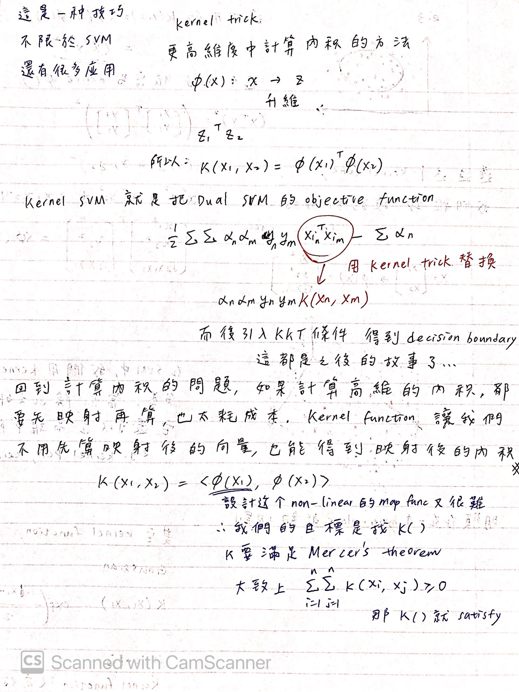
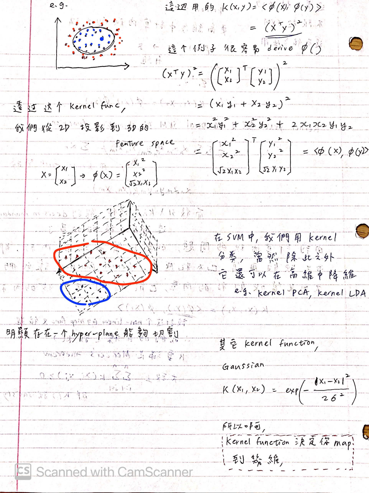

## SVM入場
先來個預告：  
* 線性SVM
* 對偶SVM (dual)
* soft-margin SVM
* kernel SVM

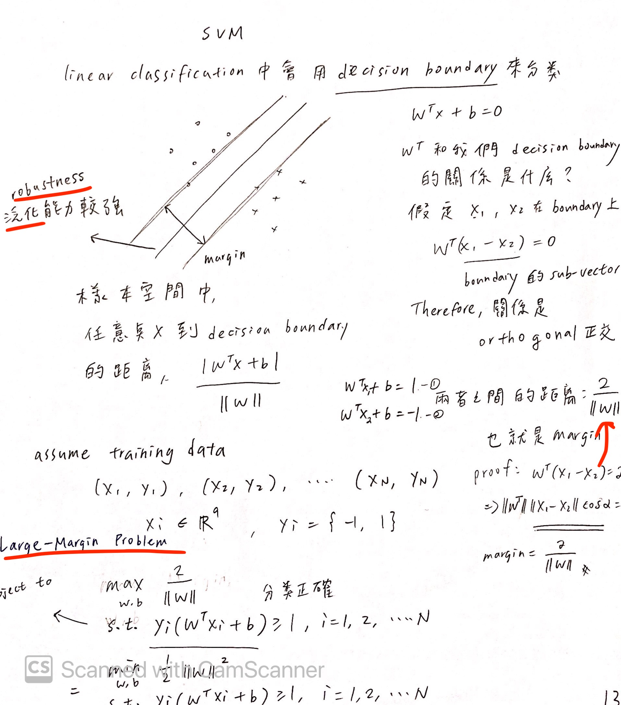
其實就是一個二次規劃(QP)問題，很好得到最優解  
不過那個條件看起來實在很惱人  
Dual SVM的話，我們甚至可以用lagrange把條件式吃掉，再得到最優解
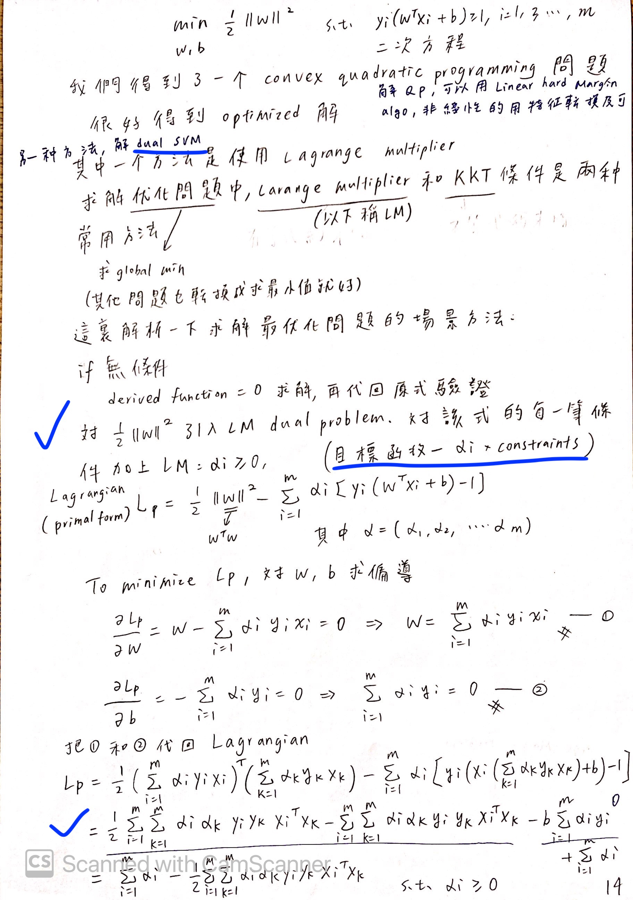
Lp的條件很簡單，參數也只有alpha，解出boundary絕對難不倒你
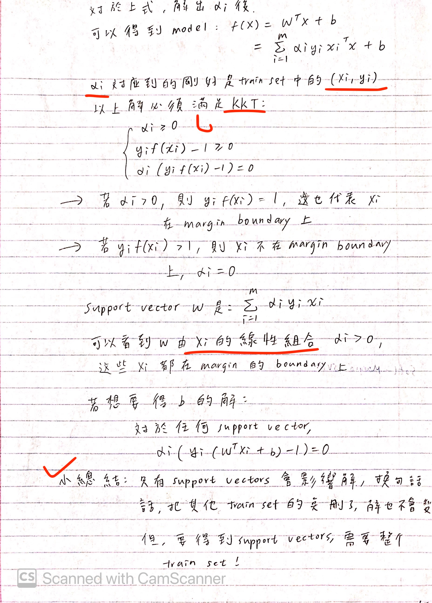
整理一下Dual SVM到底在搞什麼鬼？  
把max問題轉換成min問題(hard-margin SVM dual)，整理條件然後推導  
接下來看看soft-margin SVM  
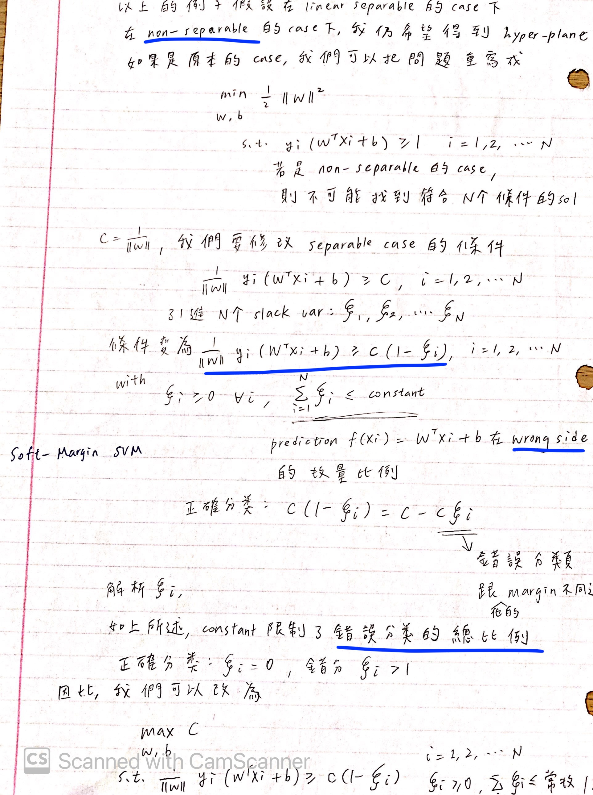
除了解決難分類的問題，還可以避免overfit  
補充一下筆記中可能沒有講清楚的部分：  
那個slack variable - i 代表的是第i個點錯誤的程度。若為0，則代表沒有錯; 越大的話，則錯誤越嚴重。  
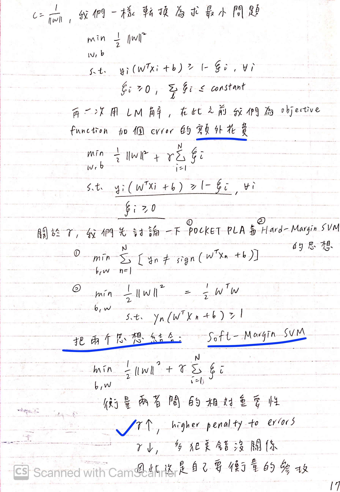
上面我們寫下了soft-margin的目標函數並且引入錯誤的成本
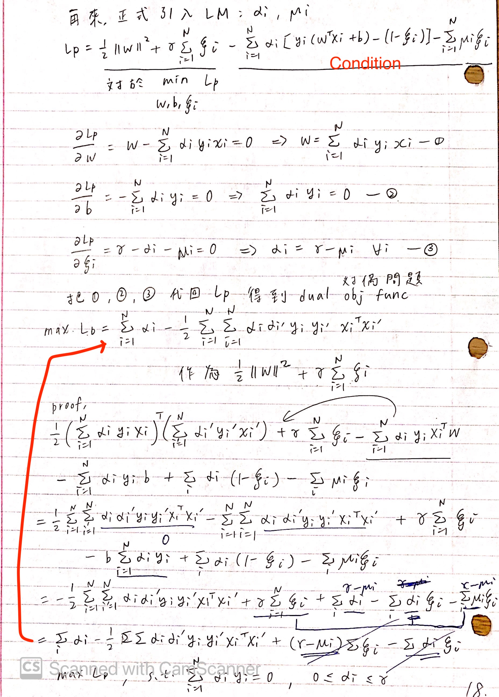
上面再次引入Lagrange得到soft-margin SVM的dual problem
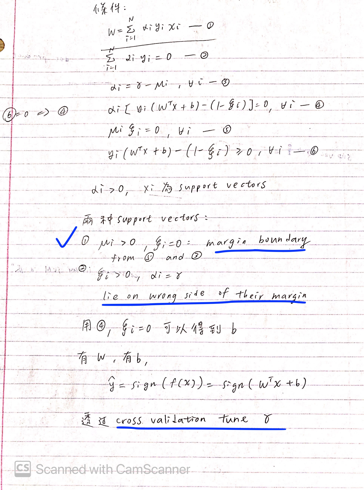
理所當然要符合我們的KKT，然後推導一下  
最後就是我們的kernel SVM了  
從上一個得到的醜八怪dual目標函數下去作轉換吧！  
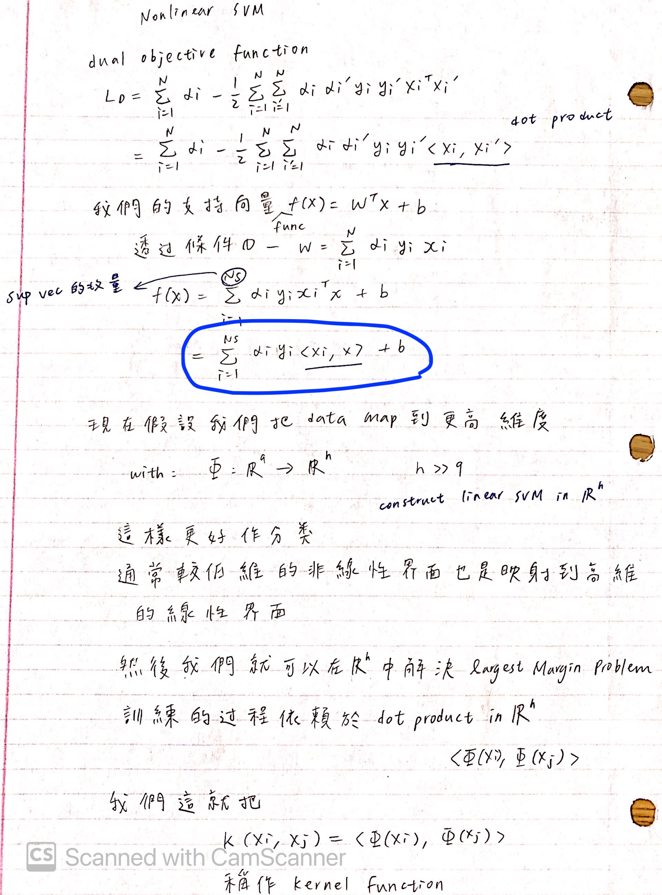
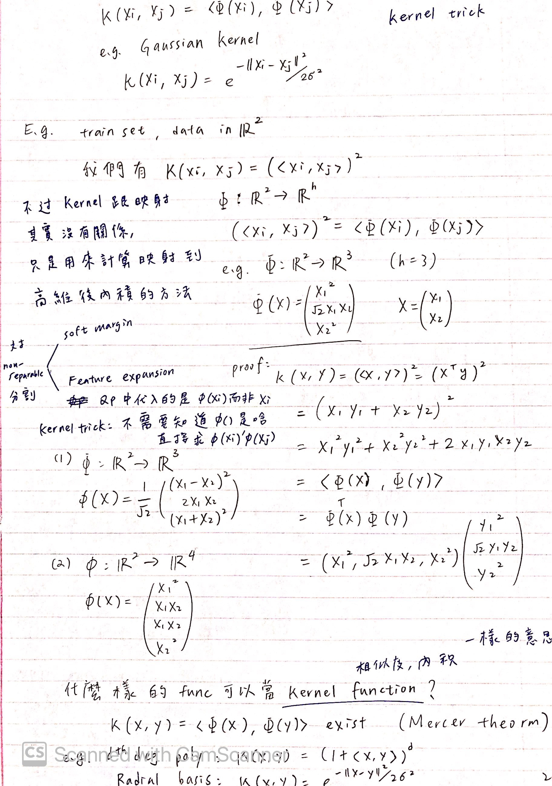
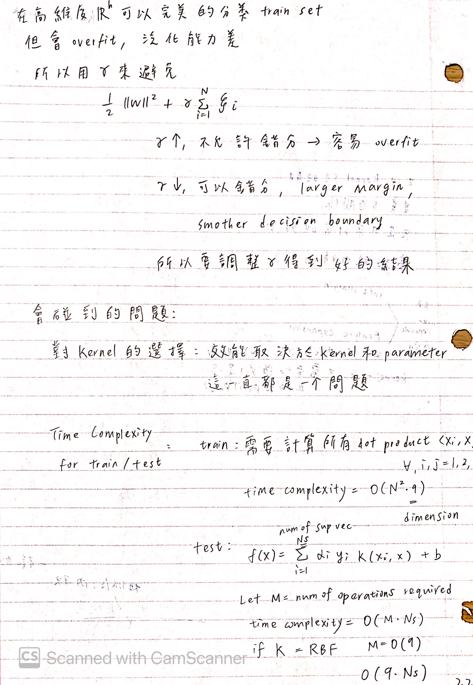