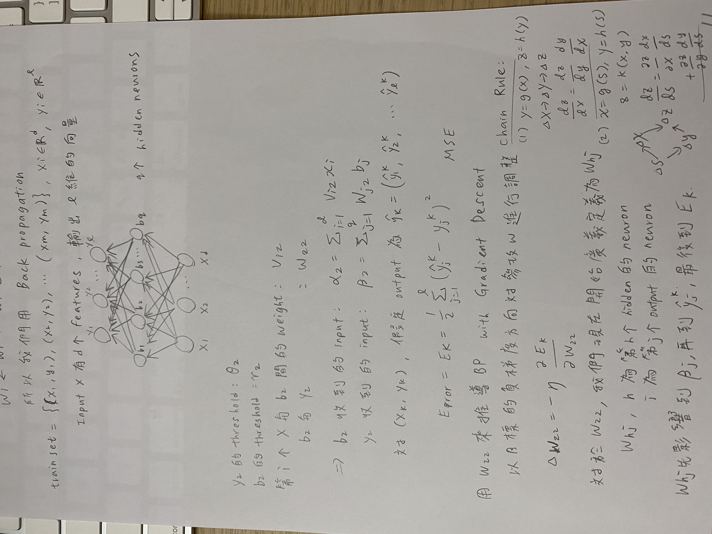
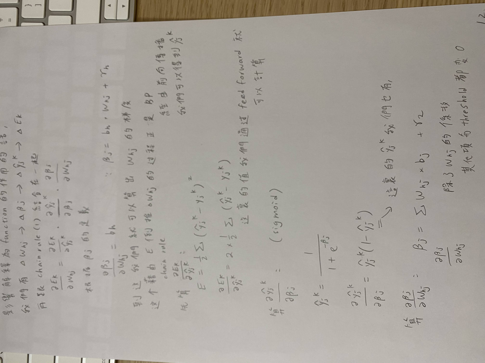

## 學習筆記
大致上是先利用feed forward算出output，然後倒著更新weight，這就是back propagation

## 實作
[bp.py](bp-with-weightedCE/bp.py)  
隨機產生binary classes dataset  
實作neural network的正向及反向傳播  
網路架構為input layer: 2, hidden layer: 2, output layer: 1  
比較特殊的是loss function實作了REAL-World-Cost-Loss-Function，是帶權重的cross entropy，所以再反向傳播的部分微分稍作修改即可  