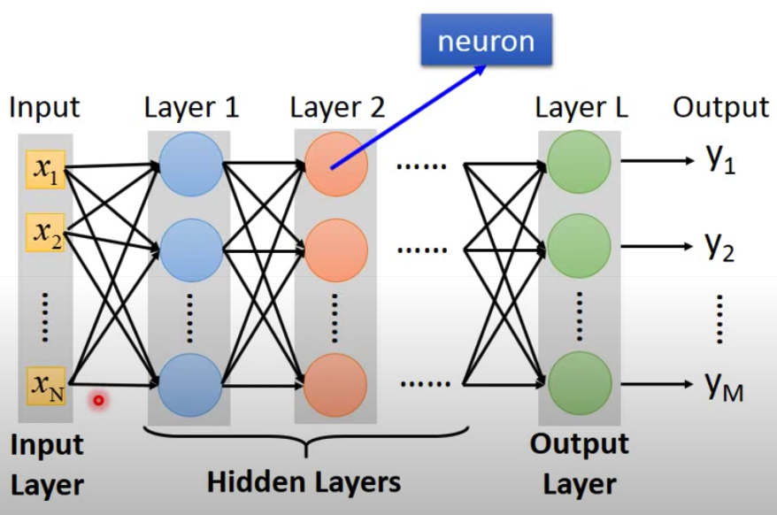
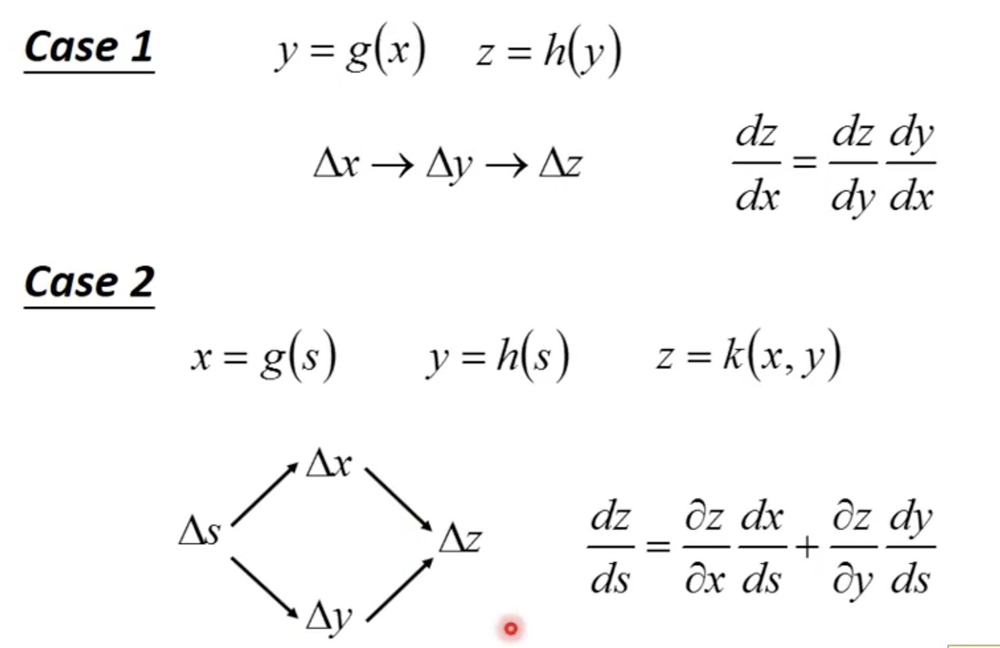

## 什麼是Neural Network?
不同的Neuron合併或串接在一起組成Neural network  
每一個neuron都是由logistic regression組成  
不同的串接方式會有不同的網路架構  
回去看看我們的logistic regression有哪些參數：`weight`，`bias`  
因此neural network的參數便是所有neuron的`weight`和`bias`  

我們可以把neural network視作一個function，input和output都是vector  
如果我們只有neural network的連接方式，但還沒有參數，此時的neural network則是function set  
  
上面是一種fully connect feedforward network，前一個layer的所有output便是後一個layer的所有input  
除了最一開始的input layer和最後的output layer，中間的都是hidden layer(deep便是多層hidden layers的意思)，每一層layer由數多個neuron所組成  
  

別看neuron這麼多很多output會很麻煩  
既然是vector我們當然可以把一層的input/output/weight/bias換成matrix  
因此neural network可以視為一層一層的matrix operation和sigmoid function(聽說現在都不是丟sigmoid啦...)  
常聽到的GPU加速也是在幫我們做矩陣運算之類的事情  

> 對於output layer而言  

我們當然知道他不是直接從input layer拿那些input當feature  
而是經由多層hidden layers作轉換 - 這個過程就好像 feature engineering  
這些features送到output layer之後，輸出最後的y1, y2, ...ym  
這個output layer可以視為multi-class classifier  
neural network的output便是output layer使用了softmax，那個output代表了各個結果的probability distribution  
e.g. 我們把一張手寫數字的筆跡送進這個neural network  
輸入便是整張圖16*16的pixel，每個pixel只有兩種輸出: 0代表白，1代表黑，總共256維度的vector  
輸出則是10維度的vector，代表從0, 1~9的機率。假如2的機率佔了足足`0.7`，那這張圖代表2的機率就非常高了。  
我們知道了input和output的維度，剩下就是決定中間的structure了  
**這裡很重要：**  
input和output的dimensions很容易得知，剩下就是network的架構了  
**之前在logistic regression或linear regression我們都無需設計model的架構，但對於neural network而言，中間要有幾層hidden layers，每層layer要有多少neuron都是要自己設計的，他也是決定function set的長相**。  

> 怎麼設計network structure呢？

我們來比較看看語音/影像辨識和NLP  
network structure v.s. feature engineering  
上面有提到中間的hidden layer就好像在作feature transformation  
**但其實deep learning根本不需要feature extraction的動作**  
我們都知道DL在語音和影像辨識的部分風生水起  
透過DL，我們完全不需要抽取部分pixel，而是把整個pixel丟進去硬幹！  
所以問題變成**選取重要feature好 還是 設計network架構好？**  
:wink: 語音/影像辨識  
先給個結論，這部分直接作network structure容易太多了  
因為這個東西離人類實在無法理解，機器覺得重要的向量我們卻看不出來  
因此嘗試各種network structure讓機器自己找出好的feature才是正解。  
:wink: NLP  
不過DL在NLP上就不怎麼U秀了  
因為人類在語言這方面處理以及理解的能力比機器還要好太多了  
因此DL給NLP的進度和優勢就不怎麼顯著了  

> 如何判定好的function？

把我們的target丟到output會得到一組y值(也就是答案)  
把我們的input丟進network到最後經由softmax也會輸出一組y值  
然後跟之前在discriminative model提到的方法一樣，取兩個的cross entroy，當然會有多個cross entropy，所有cross entropy總和起來便是total loss  
我們想個辦法調整參數來讓total loss得到最小值，使用的方法便是gradient descent囉！  
gradient descent就算在DL裡面還是微分求導數之類的，本質不會變，只不過function變得很複雜  
我們針對每個weight，每個bias下去作偏微分，當然這實在是太麻煩了...  
backpropagation（反向傳播）算是一個比較有效的微分計算方式  
現在大多用tensorflow和pytorch之類的toolkit幫我們計算了  

## BP演算法
在neural network裡面作gradient descent最麻煩的地方在於上百萬個`w`和`b`參數  
backpropagation是一種比較有效率的gradient descent方法  
核心是chain rule：  
  

* [在這裡給個BP的練習題](https://zhuanlan.zhihu.com/p/32819991)