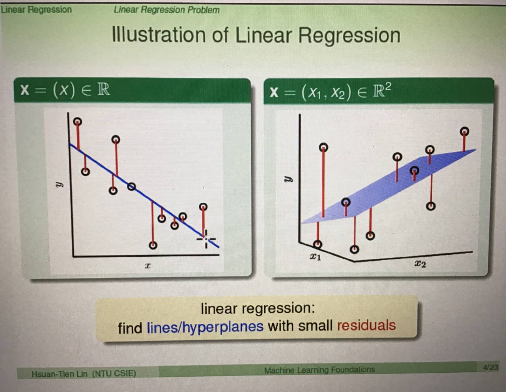

## Linear Regression
- 特徵x=(x0,x1,x2,....,xd)
- 加權sum: y ≈ Σ(i=0->d)wixi
- Linear Regression Hypothsis: h(x)=w^T*x
- 找一條residuals最小的線
- 是連續、可以微分且有谷(有最小值)的函數

##### 要如何知道他是否真的有學習到
看Eout(wLIN)是否是好的(最小值)